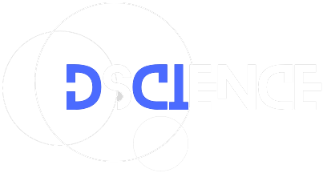

# IBM Qiskit Fall Fest - DCI
<!--
*** Thanks for checking out the Best-README-Template. If you have a suggestion
*** that would make this better, please fork the repo and create a pull request
*** or simply open an issue with the tag "enhancement".
*** Thanks again! Now go create something AMAZING! :D
-->

<!-- PROJECT SHIELDS -->
<!--
*** I'm using markdown "reference style" links for readability.
*** Reference links are enclosed in brackets [ ] instead of parentheses ( ).
*** See the bottom of this document for the declaration of the reference variables
*** for contributors-url, forks-url, etc. This is an optional, concise syntax you may use.
*** https://www.markdownguide.org/basic-syntax/#reference-style-links
-->
<!-- [![Contributors][contributors-shield]][contributors-url]  -->
<!-- [![Forks][forks-shield]][forks-url]  -->
<!-- [![Stargazers][stars-shield]][stars-url]  -->
<!-- [![MIT License][license-shield]][license-url]  -->
<!-- [![Issues][issues-shield]][issues-url]  -->
<!-- [![LinkedIn][linkedin-shield]][linkedin-url]  -->


<!-- PROJECT LOGO -->
<br />
<p align="center">
  <a href="https://www.dscience.ugto.mx/index.php/dscience">
    
  </a>

  <h3 align="center">Revista DsCIence</h3>

  <p align="center">
    El repositorio oficial del evento de programación de la revista DsCIence, para desarrolladores y estudiantes.
    <br />
    <a href="https://github.com/othneildrew/Best-README-Template"><strong>Ir a los documentos »</strong></a>
    <br />
    <br />
    <a href="https://www.dscience.ugto.mx/index.php/dscience">Ver Página Oficial</a>
    <!--·
     <a href="https://github.com/othneildrew/Best-README-Template/issues">Workflow</a>
    · -->
    <!--<a href="https://dsciencejournal.netlify.app/redes">Redes Sociales</a>-->
  </p>
</p>

<p align="center">
  Todo sobre el nuevo evento de programación y cómputo cuántico de la División de Ciencias e Ingenierías en un solo lugar. Encuentra aquí el material de los talleres así como documentación adicional.
</p>

La revista DsCIence publica semestralmente, tratamos una amplia variedad de temas científicos y damos a conocer el trabajo de investigación de estudiantes y profesores-investigadores de la División. Para más infromación, pueden visitar nuestras redes sociales:

[](https://www.instagram.com/revista_dscience/)
[](https://www.facebook.com/people/Revista-DSCIence/100091361100082/)
[](https://www.youtube.com/channel/UCgYe6UvFxs3nmXxycLzA3Mg)

Si busca colaborar con nosotros de manera externa a la institución, o leer nuestras entregas, por favor revise nuestra página oficial.
</p>


<!-- TABLE OF CONTENTS -->
<details open="open">
  <summary>Tabla de Contenidos</summary>
  <ol>
    <li>
      <a href="#about-the-project">Sobre el evento</a>
      <ul>
        <li><a href="#built-with">Lenguaje de programación</a></li>
      </ul>
    </li>
    <li>
      <a href="#getting-started">¿Cómo empiezo?</a>
      <ul>
        <li><a href="#prerequisites">Prerrequisitos</a></li>
        <li><a href="#installation">Instalación de Python</a></li>
      </ul>
    </li>
    <li><a href="#usage">¿Cómo usar el repositorio?</a></li>
    <li><a href="#roadmap">Roadmap</a></li>
    <li><a href="#contributing">Contribuciones</a></li>
    <li><a href="#license">Licencia</a></li>
    <li><a href="#contact">Contacto</a></li>
    <li><a href="#acknowledgements">Agradecimientos</a></li>
  </ol>
</details>


<!-- ABOUT THE PROJECT -->
## Sobre el evento

<p align="center">
  <a href="https://www.ibm.com/mx-es">
    
  </a>
  
  <a href="https://www.dscience.ugto.mx/index.php/dscience">
    
  </a>
</p>
  
Este evento está organizado por la revista **DsCIence** de la DCI, Universidad de Guanajuato en conjunto con el evento internacional IBM Qiskit Fall Fest que se celebra anualmente. Su propósito es el de acercar a la comunidad al mundo de la programación diseminando las novedosas tecnologías del cómputo cuántico y las técnicas del análisis de datos (Machine Learning, IA, etc.).

Here's why:
* Your time should be focused on creating something amazing. A project that solves a problem and helps others
* You shouldn't be doing the same tasks over and over like creating a README from scratch
* You should implement DRY principles to the rest of your life :smile:

Of course, no one template will serve all projects since your needs may be different. So I'll be adding more in the near future. You may also suggest changes by forking this repo and creating a pull request or opening an issue. Thanks to all the people have contributed to expanding this template!

A list of commonly used resources that I find helpful are listed in the acknowledgements.

### Lenguaje de programación

This section should list any major frameworks that you built your project using. Leave any add-ons/plugins for the acknowledgements section. Here are a few examples.
* [Bootstrap](https://getbootstrap.com)
* [JQuery](https://jquery.com)
* [Laravel](https://laravel.com)


<!-- GETTING STARTED -->
## ¿Cómo empiezo?

This is an example of how you may give instructions on setting up your project locally.
To get a local copy up and running follow these simple example steps.

### Prerrequisitos

This is an example of how to list things you need to use the software and how to install them.
* npm
  ```sh
  npm install npm@latest -g
  ```

### Instalación de Python

1. Get a free API Key at [https://example.com](https://example.com)
2. Clone the repo
   ```sh
   git clone https://github.com/your_username_/Project-Name.git
   ```
3. Install NPM packages
   ```sh
   npm install
   ```
4. Enter your API in `config.js`
   ```JS
   const API_KEY = 'ENTER YOUR API';
   ```


<!-- USAGE EXAMPLES -->
## ¿Cómo usar el repositorio?

Use this space to show useful examples of how a project can be used. Additional screenshots, code examples and demos work well in this space. You may also link to more resources.

_For more examples, please refer to the [Documentation](https://example.com)_


<!-- ROADMAP -->
<!-- ## Roadmap

See the [open issues](https://github.com/othneildrew/Best-README-Template/issues) for a list of proposed features (and known issues). -->


<!-- CONTRIBUTING -->
## Contribuciones

Contributions are what make the open source community such an amazing place to learn, inspire, and create. Any contributions you make are **greatly appreciated**.

1. Fork the Project
2. Create your Feature Branch (`git checkout -b feature/AmazingFeature`)
3. Commit your Changes (`git commit -m 'Add some AmazingFeature'`)
4. Push to the Branch (`git push origin feature/AmazingFeature`)
5. Open a Pull Request


<!-- LICENSE -->
## Licencia

Código distribuido bajo la licencia MIT. Para más información ver el archivo `LICENSE`.

MIT License

Copyright (c) 2025 Revista DsCIence

Permission is hereby granted, free of charge, to any person obtaining a copy
of this software and associated documentation files (the "Software"), to deal
in the Software without restriction, including without limitation the rights
to use, copy, modify, merge, publish, distribute, sublicense, and/or sell
copies of the Software, and to permit persons to whom the Software is
furnished to do so, subject to the following conditions:

The above copyright notice and this permission notice shall be included in all
copies or substantial portions of the Software.

THE SOFTWARE IS PROVIDED "AS IS", WITHOUT WARRANTY OF ANY KIND, EXPRESS OR
IMPLIED, INCLUDING BUT NOT LIMITED TO THE WARRANTIES OF MERCHANTABILITY,
FITNESS FOR A PARTICULAR PURPOSE AND NONINFRINGEMENT. IN NO EVENT SHALL THE
AUTHORS OR COPYRIGHT HOLDERS BE LIABLE FOR ANY CLAIM, DAMAGES OR OTHER
LIABILITY, WHETHER IN AN ACTION OF CONTRACT, TORT OR OTHERWISE, ARISING FROM,
OUT OF OR IN CONNECTION WITH THE SOFTWARE OR THE USE OR OTHER DEALINGS IN THE
SOFTWARE.


<!-- CONTACT -->
<!-- ## Contacto

Your Name - [@your_twitter](https://twitter.com/your_username) - email@example.com

Project Link: [https://github.com/your_username/repo_name](https://github.com/your_username/repo_name) -->


<!-- ACKNOWLEDGEMENTS -->
## Agradecimientos
* [GitHub Emoji Cheat Sheet](https://www.webpagefx.com/tools/emoji-cheat-sheet)
* [Img Shields](https://shields.io)
* [Choose an Open Source License](https://choosealicense.com)
* [GitHub Pages](https://pages.github.com)
* [Animate.css](https://daneden.github.io/animate.css)
* [Loaders.css](https://connoratherton.com/loaders)
* [Slick Carousel](https://kenwheeler.github.io/slick)
* [Smooth Scroll](https://github.com/cferdinandi/smooth-scroll)
* [Sticky Kit](http://leafo.net/sticky-kit)
* [JVectorMap](http://jvectormap.com)
* [Font Awesome](https://fontawesome.com)


<!-- MARKDOWN LINKS & IMAGES -->
<!-- https://www.markdownguide.org/basic-syntax/#reference-style-links -->
[contributors-shield]: https://img.shields.io/github/contributors/othneildrew/Best-README-Template.svg?style=for-the-badge
[contributors-url]: https://github.com/othneildrew/Best-README-Template/graphs/contributors
[forks-shield]: https://img.shields.io/github/forks/othneildrew/Best-README-Template.svg?style=for-the-badge
[forks-url]: https://github.com/othneildrew/Best-README-Template/network/members
[stars-shield]: https://img.shields.io/github/stars/othneildrew/Best-README-Template.svg?style=for-the-badge
[stars-url]: https://github.com/othneildrew/Best-README-Template/stargazers
[issues-shield]: https://img.shields.io/github/issues/othneildrew/Best-README-Template.svg?style=for-the-badge
[issues-url]: https://github.com/othneildrew/Best-README-Template/issues
[license-shield]: https://img.shields.io/github/license/othneildrew/Best-README-Template.svg?style=for-the-badge
[license-url]: https://github.com/othneildrew/Best-README-Template/blob/master/LICENSE.txt
[linkedin-shield]: https://img.shields.io/badge/-LinkedIn-black.svg?style=for-the-badge&logo=linkedin&colorB=555
[linkedin-url]: https://linkedin.com/in/othneildrew
[product-screenshot]: images/screenshot.png
